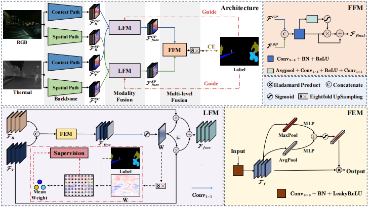

## LRFNet

Code and result about LRFNet (BMVC 2023)

Label-guided Real-time Fusion Network for RGB-T Semantic Segmentation

## Requirements

Python 3.9.13 Pytorch 1.12.0 Cuda 11.3, TensorboardX 2.0, opencv-python

## Data

## Result

Pretrained models and Predict maps could be found in [baidu](https://pan.baidu.com/s/15HrIL4fyxIafFkQQ5B6hPQ) 提取码: bear

## Testing
#### download the checkpoints and save in ./checkpoint/
#### <mark>python run_demo_MFNet.py --data_dir [your data_dir]<mark>
#### <mark>python run_demo_PST.py --data_dir [your data_dir]<mark>
## Acknowledgement
The implement of this project is based on the code of ‘RTFNet: RGB-Thermal Fusion Network for Semantic Segmentation of Urban Scenes (IEEE RAL)’ proposed by Yuxiang Sun et all.

## Contact
Please drop me an email for further discussion: linzr9@mail2.sysu.edu.cn or linbaihong111@126.com .